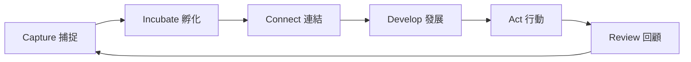
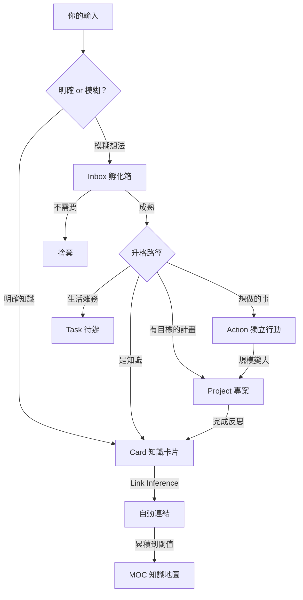
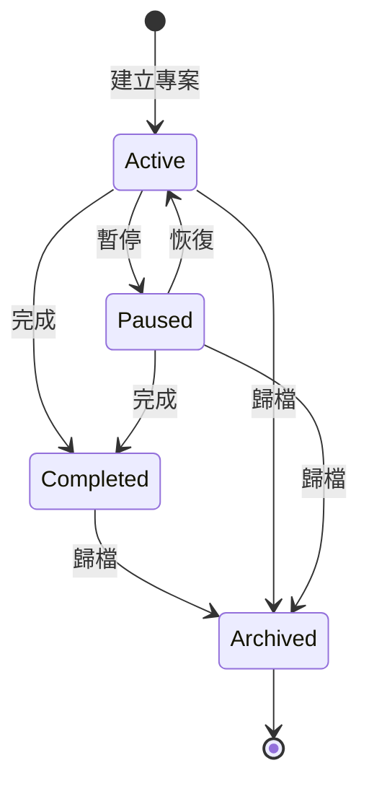

# TwinMind

> 人類與 AI 的共同心智 — AI 驅動的個人知識與專案管理系統

TwinMind 整合了**卡片盒筆記法 (Zettelkasten)**、**LYT (Linking Your Thinking)** 與 **PARA 方法**，透過 Claude Code 的 Skills 與 Hooks 機制，讓 AI 全權處理知識庫的建卡、連結、維護與專案管理。你只需要用自然語言說話，AI 就是你的第二大腦。

## 初衷與想法

我使用卡片盒筆記法已經超過三年，是這套方法的深度受益者。但我一直在思考一件事：**如何把記錄想法與學習的摩擦力降到最低？**

從學習了 vibe coding 之後，我開始嘗試用 AI 來解決這個問題。去年開始陸續看到國外社群分享 AI + Obsidian 打造個人知識管理系統的案例，於是上個月開始認真打磨自己的想法。結果上禮拜 Andrej Karpathy 就發佈了一篇關於個人知識管理的熱門貼文並開源了自己的方案 — 蠻開心自己正在做的事跟大神有同步到。

比起很厲害的 UI 或龐大的系統，我花最多時間打磨的其實是**個人筆記方法論**本身。因此我想把自己整合各種筆記方式的系統分享出來。

這套系統取名為 **TwinMind**，因為它是人類與 AI 的共同心智 — 你的想法透過 AI 被結構化、連結、發展，形成一個持續生長的知識有機體。

在此感謝個人知識管理領域的各位先進：從發明者 Niklas Luhmann、研究者 Sönke Ahrens、到台灣的朱騏老師，還有 Heptabase 的詹雨安、瓦基等各路大神，讓我走進卡片盒的世界並擁有了第二大腦。希望這個小小作品能成為有興趣一同成長的人的助力！

## 如何透過 Claude 管理與操作知識庫

TwinMind 的所有操作都透過自然語言完成。你不需要學習任何指令 — 只需要像跟人說話一樣告訴 Claude 你的想法，系統會自動判斷意圖並執行對應操作。

**九大意圖自動路由：**

| 你說的話 | AI 判斷的意圖 | 系統做的事 |
|---------|-------------|----------|
| 「Rust 的所有權機制是...」 | CAPTURE | 建立知識卡片 |
| 「突然想到睡眠跟創造力好像有關」 | INBOX | 收進孵化箱，等待成熟 |
| 「開始整理讀書筆記」 | ACTION | 建立獨立行動 |
| 「買牛奶」 | TASK | 建立生活待辦 |
| 「建立專案：發佈 TwinMind」 | PROJECT | 建立專案並追蹤進度 |
| 「我想持續關注健康管理」 | AREA | 建立持續關注領域 |
| 「找跟 AI 相關的筆記」 | QUERY | 搜尋知識庫 |
| 「知識庫狀況如何？」 | REVIEW | 健康檢查與維護 |
| 「把 X 和 Y 連起來」 | CONNECT | 建立卡片間連結 |

**背後的自動化：**

- **意圖解析**：AI 根據信號詞與語境自動分類，不需要記任何指令
- **Link Inference**：建立卡片後，AI 自動分析既有卡片並建議相關連結
- **Post-op Pipeline**：每次狀態變更後，背景自動更新 Changelog、MOC、Home 與 Dashboard
- **Validation Hooks**：所有寫入自動驗證 frontmatter 格式與索引一致性，確保資料完整

## 安裝

### 前置需求

- [Claude Code CLI](https://docs.anthropic.com/en/docs/claude-code) 或 [Claude Desktop (Claude Cowork)](https://claude.ai/download) — 主要互動介面
- [Obsidian](https://obsidian.md/) — 知識庫瀏覽用（唯讀）

### 快速開始

```bash
# 1. 安裝 TwinMind plugin
claude plugin install github:VolderLu/TwinMind

# 2. 在任意目錄建立知識庫
mkdir my-brain && cd my-brain
claude
# 輸入 /twinmind:setup 開始初始化

# 3. 開始對話 — 就這麼簡單
```

Setup 會引導你建立 `TwinMind.md`（設定檔）和 vault 目錄結構。完成後 Claude 會在每次啟動時自動偵測 `TwinMind.md` 並啟用意圖路由。

> **提示：** 用 Obsidian 開啟 vault 資料夾即可瀏覽所有筆記、MOC 與 Dashboard。Obsidian 僅作為瀏覽器，所有寫入操作都由 AI 完成。

### 設定

所有設定集中在專案根目錄的 `TwinMind.md`（YAML frontmatter）：

```yaml
---
vault_dir: vault
vault_name: TwinMind
locale: zh-TW
moc_threshold_create: 5
moc_threshold_split: 20
recent_cards_count: 5
default_card_type: concept
memo_stale_days: 7
action_stale_days: 14
domains: []
---
```

你可以用任何編輯器或 Obsidian 直接編輯這個檔案。

### 知識庫結構

```text
my-brain/
├── TwinMind.md               # 設定檔（YAML frontmatter）
└── vault/                    # 知識庫本體（用 Obsidian 開啟此資料夾）
    ├── Home.md               # 知識庫首頁
    ├── Atlas/                # MOC（知識地圖，自動生成）
    ├── Cards/                # 知識卡片
    ├── Sources/              # 來源引用卡片
    ├── PARA/                 # 行動管理層
    │   ├── Inbox/            # 孵化箱
    │   ├── Projects/         # 專案
    │   ├── Areas/            # 持續關注領域
    │   ├── Actions/          # 獨立行動
    │   ├── Tasks/            # 生活待辦
    │   ├── Archive/          # 歸檔
    │   └── Dashboard.md      # 行動層總覽
    └── System/               # 系統索引
        ├── vault-index.json  # 知識庫索引（AI 的記憶）
        └── changelog-*.md    # 操作日誌
```

## 知識庫的六大循環

TwinMind 的運作基於六個持續循環的階段，形成一個知識的生命週期：



### 1. 捕捉 (Capture)

將想法、知識、靈感從腦中釋放到系統中。不需要想格式、分類或放在哪裡 — 只需要說出來。

- 明確的知識 → 直接建立**知識卡片** (Card)
- 模糊的想法 → 先進入**孵化箱** (Inbox)
- 來源引用 → 建立**來源卡片** (Source)

> 「降低捕捉的摩擦力」是整個系統最核心的設計原則。

### 2. 孵化 (Incubate)

Inbox 是半成熟想法的安全網。不是每個念頭都能馬上變成卡片，但也不該被遺忘。

- 定期回顧 Inbox 中的 memo 與 idea
- 成熟的想法**升格**為 Card、Action、Task 或 Project
- 不再需要的想法可以安心**捨棄**
- 系統會提醒你超過期限未處理的項目

### 3. 連結 (Connect)

孤立的筆記只是資料，**連結後的筆記才是知識**。

- 建立卡片時，AI 自動進行 **Link Inference** — 分析既有卡片並建議相關連結
- 你也可以手動指定兩張卡片間的關係（如 analogous、supports、contradicts）
- 當同一領域的卡片累積到閾值，系統自動建立 **MOC (Map of Content)** — 知識地圖

### 4. 發展 (Develop)

卡片有三個生命階段：**Seed → Growing → Evergreen**。

- **Seed**：剛建立的想法種子，等待發展
- **Growing**：正在補充、深化的卡片
- **Evergreen**：經過反覆驗證、穩定成熟的知識

透過持續補充、修正、與其他卡片交叉參照，讓知識從種子長成大樹。

### 5. 行動 (Act)

知識的價值在於**驅動行動**。TwinMind 整合了完整的 PARA 行動管理：

- **Project**：有明確目標與截止日的專案
- **Action**：有範圍但不屬於專案的獨立行動
- **Task**：簡單的生活待辦
- **Area**：持續關注的責任領域（如健康管理、職涯發展）

卡片可以連結至專案，讓知識直接支撐你的行動。

### 6. 回顧 (Review)

定期回顧確保知識庫保持健康與活力：

- **Vault Status**：整體健康檢查
- **Seed Review**：哪些種子需要發展？
- **MOC Review**：知識地圖是否需要更新？
- **Index Verify**：索引一致性驗證
- **Inbox Triage**：過期的想法需要處理
- **Action Check**：停滯的行動需要推進

回顧的產出又會觸發新的捕捉與行動，形成正向循環。

## 從想法到知識與行動

每一個輸入都有歸宿。TwinMind 將模糊的念頭與明確的知識分流處理，最終匯聚成可行動的產出：



## 專案生命週期

專案從建立到歸檔，經歷完整的狀態流轉。每個關鍵節點都內建了反思機制，將行動中的收穫轉化回知識：



**專案運作機制：**

- **建立**：定義目標與截止日，自動建立 goal / log / actions / tasks 四份文件
- **進行中**：記錄進度、管理專案內的 Action 與 Task、連結相關知識卡片
- **暫停 / 恢復**：靈活調整優先順序
- **完成**：觸發**反思鉤** — AI 主動詢問「做完這個專案你有什麼收穫或教訓？要建卡嗎？」，將行動經驗轉化為知識卡片
- **歸檔**：移入 Archive，卡片的歷史連結保留

> 從想法孵化成行動，行動完成後反思回饋為知識 — 這就是 TwinMind 知識與行動的雙向循環。

## Dashboard — 你的雙面儀表板

TwinMind 透過兩個自動生成的頁面，讓你隨時掌握知識庫與行動層的全貌：

### Home.md — 知識層總覽

打開 Obsidian 的第一個畫面。一眼看見知識庫的現況：

- **進行中專案** — 目前正在推進的專案清單
- **關注領域** — 長期持續關注的責任領域
- **知識地圖** — 已生成的 MOC 連結（需累積同領域 5 張卡片）
- **最近新增** — 最新建立或更新的卡片
- **待發展 Seeds** — 還在種子階段、等待深化的卡片

### Dashboard.md — 行動層總覽

所有「要做的事」集中在這裡：

- **Active Projects** — 進行中專案的目標、截止日、卡片數、Action/Task 進度
- **Standalone Actions** — 不隸屬專案的獨立行動
- **Standalone Tasks** — 生活待辦（Active / Done 分開顯示）
- **Inbox** — 孵化箱中待處理的 memo 與 idea

### 自動更新機制

兩個頁面都**不需要手動維護**。每次知識庫或行動層發生狀態變更後，Post-op Pipeline 會在背景自動重新生成對應頁面：

| 操作類型 | Home.md | Dashboard.md |
|---------|:-------:|:------------:|
| 建立/更新/連結卡片 | 自動更新 | — |
| 專案/行動/任務變更 | — | 自動更新 |
| Inbox 升格為卡片 | 自動更新 | 自動更新 |

## 開發

如果你想參與開發或修改 TwinMind：

```bash
git clone https://github.com/VolderLu/TwinMind.git
cd TwinMind
claude --plugin-dir .
```

`--plugin-dir .` 會從本地目錄載入 plugin 進行開發測試。

本專案使用 [OpenSpec](https://github.com/cldotdev/openspec) 管理變更流程。OpenSpec 相關檔案（`.claude/skills/openspec-*`、`.claude/commands/opsx/`）已加入 `.gitignore`，需要的話請自行安裝。

---

## 致謝

- **Niklas Luhmann** — 卡片盒筆記法的發明者
- **Sönke Ahrens** — 《How to Take Smart Notes》作者
- **Nick Milo** — LYT (Linking Your Thinking) 框架創建者
- **Tiago Forte** — PARA 方法創建者
- **朱騏** — 台灣卡片盒筆記法推廣者
- **詹雨安** — Heptabase 創辦人
- **瓦基** — 閱讀前哨站

## License

MIT
